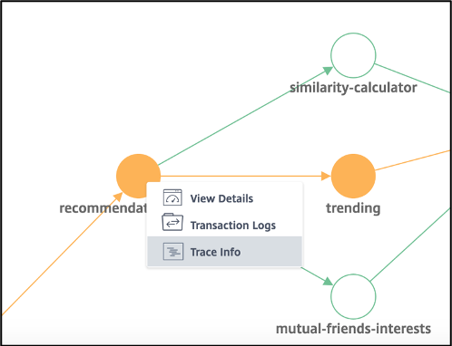
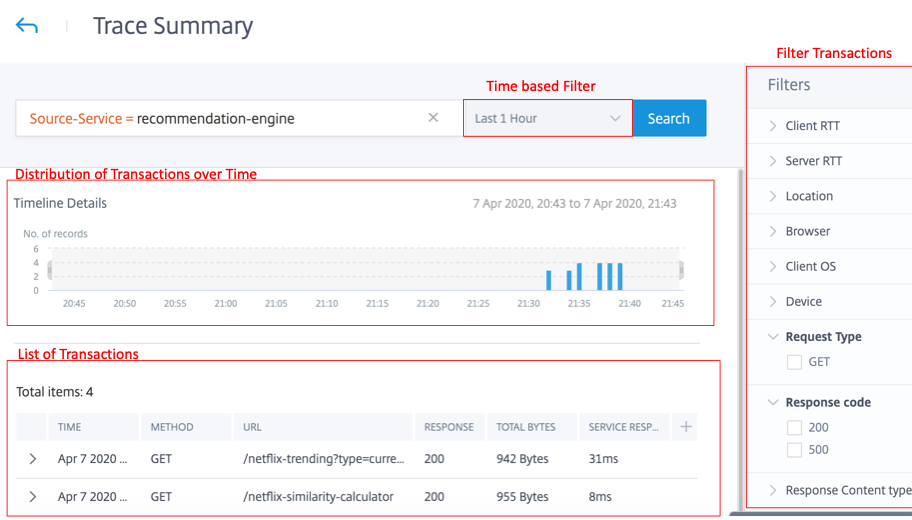

# Citrix ADM Service Graph Distributed Tracing

Visualize the request flow between different microservices using Citrix ADM


## Topology used


## Pre-requisites
1. An ADM Agent
2. Kubernetes Cluster to deploy the k8 app

## Steps

* Step 1: Register your ADM Agent to the ADM setup ( either cloud or on-prem setup)
* Step 2: Add cluster from ADM GUI. License the vservers of the CPX. ( Refer https://docs.citrix.com/en-us/citrix-application-delivery-management-service/application-analytics-and-management/sg-unified-single-ingress-topology.html#add-kubernetes-cluster-in-citrix-adm )
* Step 3: Deploy the application on the cluster
    * Step 3.1: Clone this repo
      ```
      git clone https://github.com/danny311296/citrix-service-graph-tracing
      cd citrix-service-graph-tracing
      ```
    * Step 3.2: Deploy the application
        * Option 1: Using YAML files
            The YAML file are present under `manifest/yaml` 

            Update the `cpx.yaml` with Agent IP in "LOGSTREAM_COLLECTOR_IP" and "NS_LOGPROXY", Agent Fingerprint in "NS_MGMT_FINGER_PRINT", Agent Username & Password in "NS_MGMT_USER" & "NS_MGMT_PASS"

            Update the `cic-configmap.yaml` with Agent IP in endpoint.server of `NS_ANALYTICS_CONFIG`

            Then run

            ```
            kubectl create -f cic-configmap.yaml
            kubectl create -f cpx.yaml
            kubectl create -f ingress.yaml
            kubectl create -f netflix.yaml
            ```

        * Option 2: Using Helm Charts
            The helm chart is present under `manifest/helm-chart`. 
            
            Configuration parameters:
            
The following table lists the configurable parameters and their default values in the Helm chart.


| Parameter                      | Description                   | Default                   |
|--------------------------------|-------------------------------|---------------------------|
| `cic_image`                   | CIC image to be used                    |  "quay.io/citrix/citrix-k8s-ingress-controller:1.9.9"  |
| `cpx_image`   | CPX image to be used | "quay.io/citrix/citrix-k8s-cpx-ingress:13.0-64.35"     |
| `cic_configmap.distributed_tracing`     | This variable enables or disables OpenTracing in Citrix ADC   | true                       |
| `cic_configmap.metrics`          | This variable enables or disables exporting metrics from Citrix ADC | true            |
| `cic_configmap.transactions`          | This variable enables or disables exporting transactions from Citrix ADC | false            |
| `cic_configmap.auditlogs`          | This variable enables or disables exporting audit log data from Citrix ADC | false            |
| `cic_configmap.events`     | This variable enables or disables exporting events from Citrix ADC | false                       |
| `ADM_config.ip_address`     | ADM Ip address | NIL                       |
| `ADM_config.fingerprint`     | ADM fingerprint | NIL                       |
| `ADM_config.username`     | ADM credentials username | NIL                       |
| `ADM_config.password`     | ADM credentials password | NIL                       |
| `cpx_nodeport`     | NodePort to expose cpx service | 30001                       |
| `app_replicas`     | Replicas to be used for each netflix application pod | 1                       |

   Run the below in the helm chart folder. 

      helm install netflix . --set <parameter_name>=<value> ...


* Step 4:
Send traffic using helper script
```
    nohup sh app/helper_scripts/send_traffic.sh > log &
```

## Details of Traces

On selecting “Trace Info” on any of the service graph node (say recommendation-engine), you can see all the transactions (aka spans) that the selected service has taken part in for a selected duration. 



On Drilling down on each transaction span by clicking the arrow in each row, you’ll see the details of the trace corresponding to that span transaction.


A user can select “See Trace Details” to visualize the entire trace in the form of a chart of all transactions which are part of the trace 

