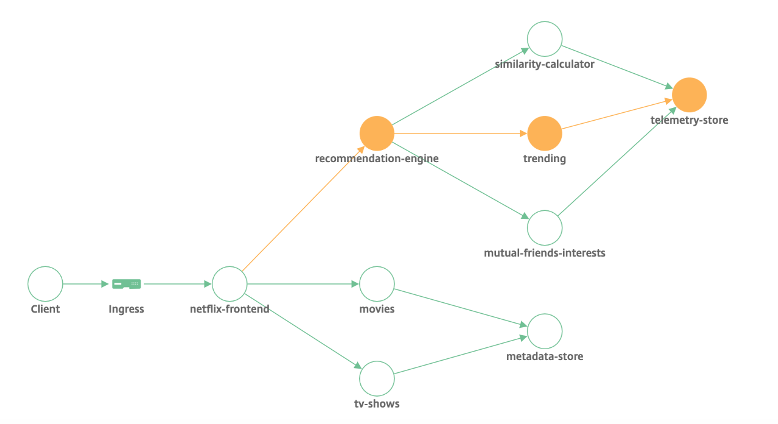
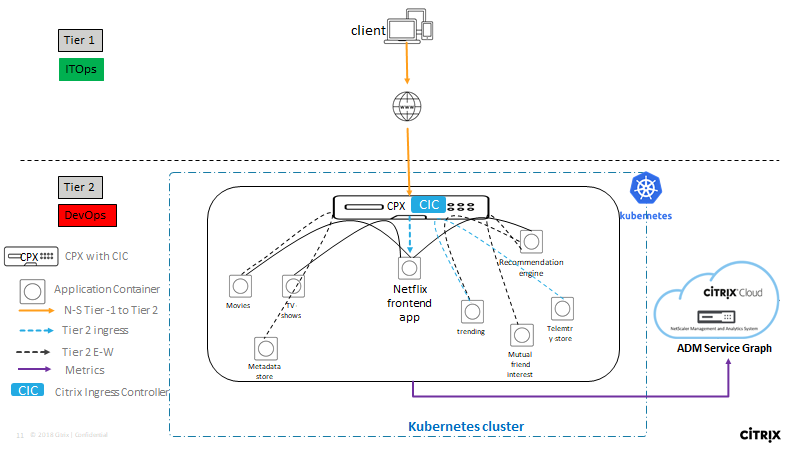
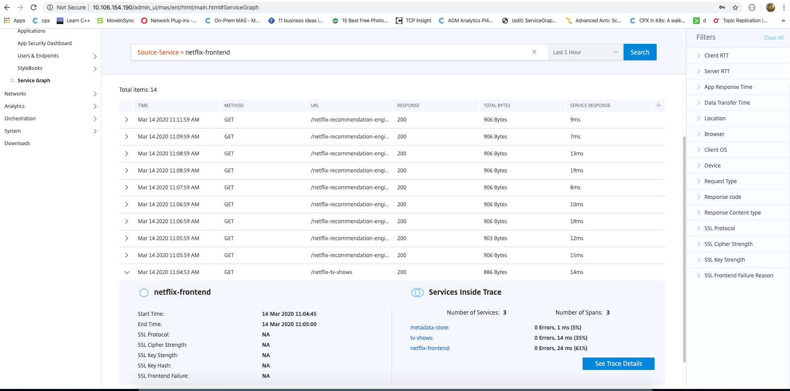
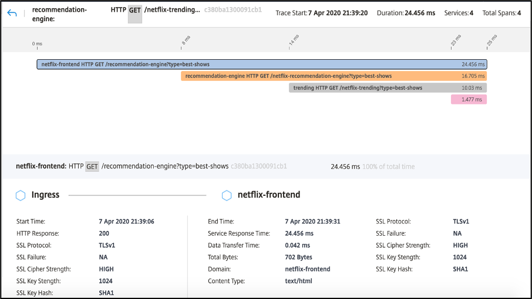

# Citrix ADM Service Graph Distibuted Tracing
Visualize the request flow between different microservices using Citrix ADM ! 

This microservice application, which was mainly developed to showcase use cases of Citrix ADM Distributed Tracing, is a dummy Netflix application which allows users to see list of movies, tv shows and makes recommendation based on factors like friends interests, similar shows & trends.






## Use cases of Distributed Tracing
* Helps in Performance RCA to understand which service is consuming most time for a given end-user request.
* Helps in reproducing issues as it gives visibility into the entire trace. Such issues would be otherwise difficut to reproduce.
* Can reduce inter-team dependencies when issues arise as the root service causing issues can be immediately found out.
* Helps Admins in understanding the behaviour of the entire application as a whole.

## Pre-requisites
1. An ADM Agent
2. A Kubernetes Cluster

## Steps

* Step 1: Register your ADM Agent to the ADM setup ( either cloud or on-prem setup)
* Step 2: Deploy the application on the cluser
    * Step 2.1: Clone this repo
      ```
      git clone https://github.com/danny311296/citrix-service-graph-tracing
      cd citrix-service-graph-tracing
      ```
    * Step 2.2: Update the cpx.yaml with Agent IP in "LOGSTREAM_COLLECTOR_IP" and "NS_LOGPROXY" enviroment variable & Agent Fingerprint in "NS_MGMT_FINGER_PRINT"
    
    * Step 2.3: Run
      ```
      kubectl create -f cpx.yaml
      kubectl create -f ingress.yaml
      kubectl create -f netflix.yaml
      ```
* Step 3: Add cluster from ADM GUI. License cs vservers of the CPX.

* Step 4:
Send traffic
```
    curl http://<CPX-IP>/tv-shows -H "Host: netflix-frontend-service"
    curl http://<CPX-IP>/movies -H "Host: netflix-frontend-service"
    curl http://<CPX-IP>/recommendation-engine?type=trending -H "Host: netflix-frontend-service"
    curl http://<CPX-IP>/recommendation-engine?type=similar-shows -H "Host: netflix-frontend-service"
    curl http://<CPX-IP>/recommendation-engine?type=mutual-friends-interests -H "Host: netflix-frontend-service" 
    curl http://<CPX-IP>/recommendation-engine?type=best-shows -H "Host: netflix-frontend-service"
  ```

## Details of Traces

Click any Service node and Select "Trace Info" to get list of all transactions that service has taken part in. On further drilling down, you can see details of all Services in that Trace.


Select "View Trace Info" to get list of all transactions in that trace and details of each transaction.



## More Updates will be made to this Readme
